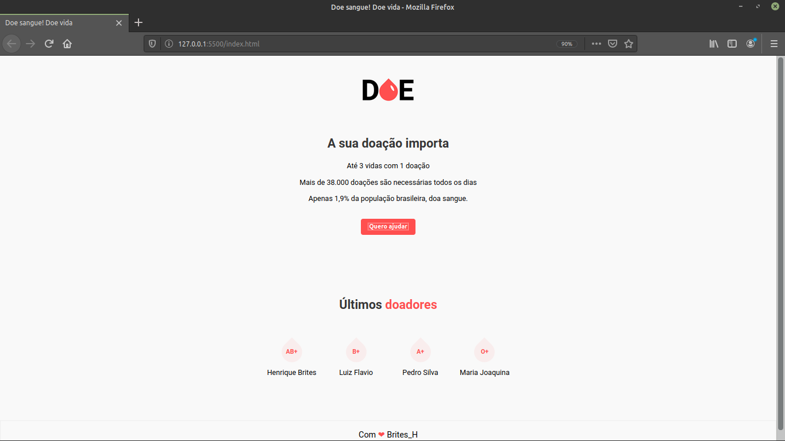
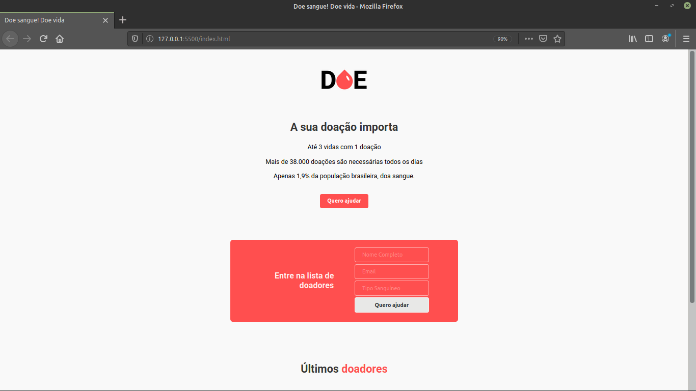

# MaratonaDev

## :rocket: Tecnologias usadas
Este maravilhoso projeto está sendo desenvolvido com as seguintes tecnologias:

- [HTML5]
- [CSS3]
- [JavaScript]

## :computer: Projeto

DOE uma aplicação para cadastro de doadores de sangue.

## Frontend

<h1 align="center"></img></h1>

<h1 align="center"></img></h1>

## :memo: Licença

Esse projeto está sob a licença MIT. Veja o arquivo [LICENSE](LICENSE) para mais detalhes.

---

<<<<<<< HEAD
Feito com ❤️ by  Henrique Brites :wave:
=======
Feito com ❤️ by  Henrique Brites :wave:
>>>>>>> d754ab04a6a581123b9f1cd8b1c924e0b238690b
